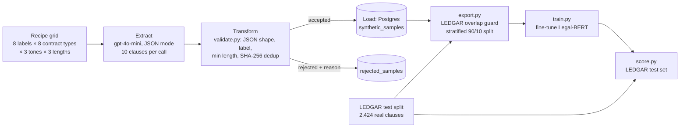

# Synthetic ETL Pipeline for Legal Clause Classification

**€0.23 of LLM-generated training data, zero hand labels: a fine-tuned Legal-BERT reaches 0.956 macro-F1 on 2,424 real contract clauses, up from 0.843 for a zero-shot baseline.**

| | Zero-shot baseline | Fine-tuned on synthetic data |
|---|---|---|
| Model | `facebook/bart-large-mnli` | `nlpaueb/legal-bert-base-uncased` |
| Training data | none | 5,064 synthetic clauses (€0.23, 0 hand labels) |
| Macro-F1 on LEDGAR test | 0.843 | **0.956** |
| Accuracy on LEDGAR test | 0.854 | **0.969** |

A teacher LLM (gpt-4o-mini) writes labelled contract clauses. An ETL pipeline validates them and loads them into Postgres. A small student model (Legal-BERT) is fine-tuned on that data alone and then scored on real clauses from SEC filings that it never saw during training or tuning.

---

## Architecture



- **Extract**: `prompts.py` builds a seeded recipe grid so that every label gets equal API calls, each with a different contract type, tone and length. `generate.py` calls gpt-4o-mini in JSON mode.
- **Transform**: `validate.py` runs pure checks: valid JSON, expected label, minimum length, and a SHA-256 hash of the normalized text for duplicates.
- **Load**: `db.py` writes each batch in its own transaction. Every run records its model, prompt version, token counts and cost in `generation_runs`. Rejected outputs are kept with their reason.
- **Budget guard**: before every API call, `pipeline.py` checks the worst-case cost of that call against `MAX_COST_EUR`.

### Generation run

| Metric | Value |
|---|---|
| Accepted clauses | 5,064 (628–640 per label) |
| Rejected | 15 (0.3%), all duplicates; 0 invalid JSON, wrong label or too short |
| Tokens | 127,710 prompt + 343,660 completion |
| Cost | €0.2254 (computed conservatively at 1 USD = 1 EUR) |
| Runtime | 58 min for the 5,000-sample run (plus an 80-sample test run) |
| Style coverage | every tone × length cell has 510–610 clauses |

Reproduce these numbers with `sql/stats.sql` (see [Reproduce](#reproduce)).

---

## Results

All numbers are on the LEDGAR test split ([LexGLUE](https://huggingface.co/datasets/coastalcph/lex_glue)), filtered to the 8 labels: 2,424 clauses from real SEC contracts. Both models are scored by the same code (`src/evaluate.py`).

| Label | Baseline F1 | Fine-tuned F1 | Change |
|---|---|---|---|
| Governing Law | 0.930 | 0.995 | +0.065 |
| Termination | 0.778 | 0.860 | +0.083 |
| Confidentiality | 0.926 | 0.946 | +0.019 |
| Indemnification | 0.929 | 0.952 | +0.023 |
| Notices | 0.935 | 0.937 | +0.002 |
| Severability | 0.665 | 0.988 | +0.323 |
| Assignment | 0.629 | 0.980 | +0.350 |
| Entire Agreement | 0.948 | 0.989 | +0.041 |
| **Macro-F1** | **0.843** | **0.956** | **+0.113** |

- Every label improved, and none regressed.
- The baseline's two weak spots are fixed. Severability recall went from 0.51 to 0.99, and Assignment precision from 0.48 to 0.98.
- 24 test clauses (1%) are longer than 512 tokens and were truncated.

Full metrics: [`results/baseline_metrics.json`](results/baseline_metrics.json), [`results/legal_bert_metrics.json`](results/legal_bert_metrics.json).

### Training

| Setting | Value |
|---|---|
| Hardware | RTX 4060 Laptop GPU (8 GB), bf16 mixed precision |
| Data | 4,557 train / 507 validation (stratified, seed 42) |
| Optimizer | AdamW, lr 2e-5, weight decay 0.01, 10% linear warmup, gradient clipping 1.0 |
| Stopping | Early stopping on validation loss (patience 2, min delta 0.001) |
| Outcome | Stopped after epoch 6, kept epoch 4; about 34 s per epoch |
| Reproducibility | Two runs with seed 42 gave identical losses |

Per-epoch history: [`results/train_history.json`](results/train_history.json).

---

## Error analysis: the Notices gap

The fine-tuned model's weakest label is **Notices** (recall 0.884). 47 of its 76 total mistakes are Notices clauses predicted as Termination (26), Indemnification (11) or Confidentiality (10).

A seeded sample of 10 of these mistakes (`scripts/inspect_errors.py`) shows a clear pattern. **9 of 10 are duties to notify someone of an event** ("Borrower shall promptly notify Lender of any Event of Default", prepayment notices, infringement, casualty). The remaining one is an indemnification claim procedure filed under a Notices heading, so its label is debatable.

The cause is the label definition given to the teacher:

> Notices: "specifies how formal communications between the parties must be delivered and when they take effect"

The teacher followed it closely. Of the 567 synthetic Notices clauses in the training split, 378 (67%) mention an address, and none mention a default, prepayment, claim, infringement or casualty. LEDGAR's Notices label covers two clause types: delivery mechanics and notification duties. The synthetic data only covered the first, so the student classified the second by its topic instead. This is a gap in what the teacher was asked to generate, not a failure of the student model.

---

## Key decisions

| Decision | Reason |
|---|---|
| LEDGAR is used only as the final test set | Keeps the "no hand labels" claim true and the test result unbiased |
| An overlap guard in `export.py` drops synthetic clauses that match a test clause | Prevents test-set leakage (0 matches found) |
| A recipe grid instead of free-form prompting | Balances classes and forces variety in contract type, tone and length |
| Rejections are stored with a reason instead of being discarded | Makes data quality measurable and debuggable |
| Macro-F1 as the main metric | The LEDGAR test set is imbalanced (118–582 per label), and macro-F1 weights every label equally |
| Early stopping on validation loss with `min_delta` | Synthetic validation F1 reaches 1.0 after epoch 1, so loss is the only signal left, and tiny drops count as noise |
| One shared scoring module for both models | The baseline vs fine-tuned comparison is like-for-like |
| A plain PyTorch training loop instead of HF `Trainer` | No extra dependency, and every step is explicit |

---

## Limitations

- **The synthetic validation set saturates.** Macro-F1 is 1.0 from epoch 1, so it measures how well the model fits the teacher's writing style, not real-world accuracy.
- **Single seed.** The results come from one training run, so there is no variance estimate.
- **Only a zero-shot baseline.** There is no comparison with a model trained on real labelled data, so the gap to that upper bound is unknown.
- **The Notices definition gap** (see Error analysis).
- **Exact-duplicate detection only.** Hashing catches identical normalized text, not paraphrases.
- **LEDGAR labels come from section headings**, so a few test labels are debatable.

## Next steps

- Broaden the Notices definition to include notification duties, and regenerate that label.
- Do error analysis on the LEDGAR **validation** split, so the test split stays untouched while iterating.
- Train with several seeds and report the mean ± standard deviation.
- Deploy an inference demo on Cloud Run.

---

## Reproduce

Requires Python 3.12, Docker, an OpenAI API key and (for reasonable speed) an NVIDIA GPU.

```bash
python -m venv .venv
source .venv/Scripts/activate        # Linux/macOS: source .venv/bin/activate
python -m pip install -r requirements.txt
cp .env.example .env                 # then fill in your key and budget

docker compose up -d                 # Postgres, schema created automatically
python -m scripts.smoke_test         # optional: one API call, nothing saved
python -m src.pipeline --samples 5000
python -m src.ledgar                 # download and filter the LEDGAR test split
python -m src.export                 # Postgres -> train/val JSONL
python -m src.baseline               # zero-shot baseline
python -m src.train                  # fine-tune Legal-BERT
python -m src.score                  # score on LEDGAR, compare with baseline
python -m pytest                     # 57 offline tests

# generation stats
docker exec -i synthetic_etl_db sh -c 'psql -U "$POSTGRES_USER" -d "$POSTGRES_DB"' < sql/stats.sql
```

**Windows note:** if `import torch` fails with `WinError 4551 ... Application Control policy has blocked this file`, Windows Smart App Control is blocking PyTorch's unsigned DLLs.

## Project layout

```
src/
  config.py      settings from .env, labels, recipe grid, file paths
  prompts.py     label definitions and the seeded recipe grid
  generate.py    OpenAI call (Extract)
  validate.py    pure validation checks (Transform)
  db.py          Postgres access (Load)
  pipeline.py    orchestrates E -> T -> L with a budget guard
  ledgar.py      LEDGAR test split, mapped to our 8 labels
  export.py      overlap guard + stratified train/val split
  evaluate.py    shared metrics and reports
  baseline.py    zero-shot NLI baseline
  train.py       Legal-BERT fine-tuning
  score.py       final evaluation on LEDGAR
scripts/
  smoke_test.py      one live API call
  inspect_errors.py  prints misclassified test clauses
sql/
  schema.sql     tables, constraints, indexes
  stats.sql      generation-run report
tests/           57 offline unit tests
results/         metrics and training history (JSON)
```